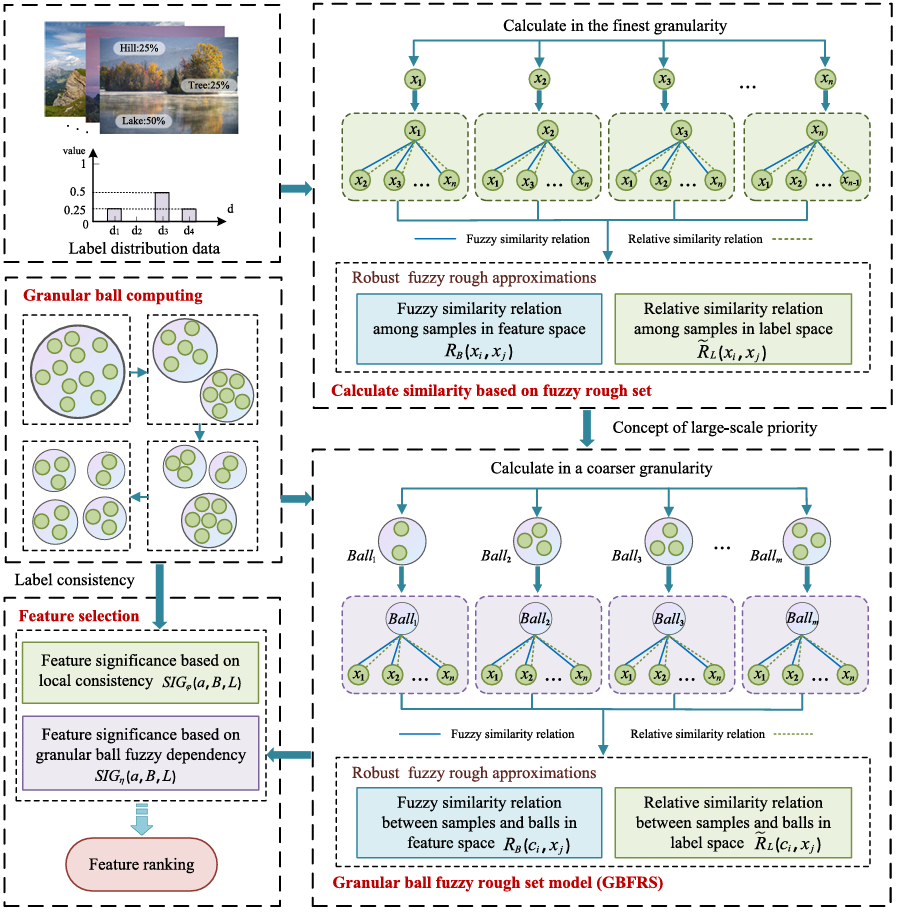

# A novel granular ball computing-based fuzzy rough set for feature selection in label distribution learning

[](https://www.python.org/downloads/) [](LICENSE) [](https://www.sciencedirect.com/science/article/abs/pii/S0950705123006482)

This repository contains the implementation of the granular ball-based feature selection algorithm for multi-label learning, as described in the research paper published in Knowledge-Based Stems.

**Note**: Please refer to the [original paper](https://www.sciencedirect.com/science/article/abs/pii/S0950705123006482) for the exact title and detailed methodology.

## 📖 Abstract

**Paper Link**: [ScienceDirect](https://www.sciencedirect.com/science/article/abs/pii/S0950705123006482)

This implementation is based on a research paper published in Knowledge-Based Systems that presents a novel granular ball-based feature selection method for multi-label learning. The paper addresses the challenge of high-dimensional feature spaces in multi-label datasets by proposing an innovative approach that integrates granular ball computing with fuzzy rough set theory.



## 💻 Code Implementation

This repository provides a complete Python implementation of the proposed algorithm with the following features:

- **Granular Ball Computing**: Implements the core granular ball construction and splitting algorithm
- **Fuzzy Rough Set Integration**: Incorporates fuzzy rough set theory for robust feature evaluation
- **Label Importance Measurement**: Calculates label significance based on co-occurrence degree
- **Multi-distance Support**: Supports Euclidean, Manhattan, and Chebyshev distance metrics
- **Parallel Processing**: Multi-process implementation for efficient computation on large datasets
- **Real-time Progress**: Visual progress tracking during feature selection process
- **Comprehensive Evaluation**: Combines lower approximation and local label consistency for feature ranking

## 🚀 Installation

### Prerequisites

- Python 3.7 or higher
- Required packages (see requirements below)

### Quick Start

1. **Install dependencies**:

   ```bash
   pip install -r requirements.txt
   ```
3. **Run the algorithm**:

   ```bash
   python main.py
   ```

## 📋 Requirements

```
numpy>=1.19.0
scipy>=1.7.0
scikit-learn>=0.24.0
PySimpleGUI>=4.60.0
```

## 🏗️ Project Structure

```
granular-ball-feature-selection/
├── main.py                          # Main execution script
├── GranularBall.py                  # Core granular ball algorithm
├── BasicFunction/                   # Supporting modules
│   ├── differences.py              # Label difference calculation
│   ├── InformationGranular.py      # Information granularity computation
│   ├── kMeans.py                   # Custom k-means implementation
│   └── LabelSignificance.py        # Label importance measurement
├── paper.pdf                       # Research paper
└── README.md                       # This file
```

## 🔧 Usage

### Basic Usage

```python
import GranularBall
import numpy as np

# Load your data
X = np.array([[1, 2, 3], [4, 5, 6], [7, 8, 9]])  # Features
Y = np.array([[1, 0, 1], [0, 1, 0], [1, 1, 0]])  # Multi-label targets

# Run feature selection
selected_features, runtime = GranularBall.AttributeReduction(
    X=X,
    Y=Y,
    min_sample=9,                    # Minimum samples per granular ball
    miss_class_threshold=0.5,        # Misclassification threshold
    distance_metric='euclidean',     # Distance metric
    dataset_name='your_dataset'
)
```

### Advanced Configuration

```python
preProcessMethod = ['standard']  # Options: 'minMax', 'standard', 'mM_std', 'std_mM'
distance_metric = ['euclidean']  # Options: 'chebyshev', 'euclidean', 'manhattan'

# Configure misclassification thresholds
miss_class_threshold = [0.05, 0.15, 0.25, 0.35, 0.45, 0.55, 0.65, 0.75, 0.85, 0.95]

# Configure granular ball sizes based on dataset size
if samples_num <= 3000:
    ball_max_sample_number_list = [7, 9, 11, 13, 15, 17, 19, 21, 23, 25, 27, 29, 31, 33, 35, 37, 39, 41, 43, 45]
elif 3000 < samples_num <= 5000:
    ball_max_sample_number_list = [17, 19, 21, 23, 25, 27, 29, 31, 33, 35, 37, 39, 41, 43, 45, 47, 49, 51, 53, 55]
elif samples_num > 5000:
    ball_max_sample_number_list = [27, 29, 31, 33, 35, 37, 39, 41, 43, 45, 47, 49, 51, 53, 55, 57, 59, 61, 63, 65]
```

## 🧮 Algorithm Overview

### 1. Granular Ball Construction

- **Initialization**: Start with the entire dataset as one granular ball
- **Splitting Condition**: Split balls based on label space differences
- **Cluster Centers**: Select samples with maximum label space difference as cluster centers
- **Stopping Criteria**: Stop splitting when ball size < minimum sample threshold

### 2. Feature Selection Process

- **Forward Selection**: Iteratively add features that maximize the objective function
- **Feature Evaluation**: Combine fuzzy rough set lower approximation and local label consistency
- **Label Importance**: Integrate label co-occurrence degree for better feature ranking
- **Adaptive Thresholding**: Use misclassification threshold to control sample recognition

### 3. Information Granularity

- **Feature Space Difference**: Calculate differences in feature space
- **Label Space Difference**: Measure differences in label space
- **Neighborhood Relations**: Establish relationships between granular balls and samples
- **Positive Region**: Compute fuzzy rough set positive region for feature evaluation

## 💻 Code Structure

The implementation consists of several key modules:

### Core Modules

- **`GranularBall.py`**: Main algorithm implementation with `GranularBall` and `GBList` classes
- **`main.py`**: Execution script with multi-process support and parameter configuration
- **`BasicFunction/`**: Supporting modules for various computations

> ### Supporting Functions

- **`differences.py`**: Label difference matrix calculation
- **`InformationGranular.py`**: Information granularity and fuzzy rough set computations
- **`kMeans.py`**: Custom k-means implementation for granular ball splitting
- **`LabelSignificance.py`**: Label importance measurement based on co-occurrence degree

## 📊 Supported Datasets

The algorithm supports various multi-label datasets including:

- **Text Classification**: CAL500, Emotions, Flags
- **Image Classification**: Birds, Image, Scene, Natural_Scene
- **Biological Data**: Yeast datasets (alpha, cdc, cold, diau, dtt, elu, heat, spo, spo5, spoem)
- **Protein Sequences**: GpositivePseAAC, GnegativePseAAC, PlantPseAAC, HumanPseAAC, VirusPseAAC, VirusGO
- **Emotion Recognition**: SJAFFE, SBU_3DFE
- **Other Domains**: Water-quality

## 🔧 Implementation Details

### Key Parameters

- **`min_sample`**: Minimum samples per granular ball (default: 9)
- **`miss_class_threshold`**: Misclassification threshold for sample recognition (range: 0.05-0.95)
- **`distance_metric`**: Distance metric for clustering ('euclidean', 'manhattan', 'chebyshev')
- **`preProcessMethod`**: Data preprocessing method ('standard', 'minMax', 'mM_std', 'std_mM')

### Performance Features

- **Multi-process Support**: Parallel execution for multiple parameter combinations
- **Progress Tracking**: Real-time progress monitoring with PySimpleGUI
- **Error Handling**: Robust error handling for long-running experiments
- **Result Logging**: Comprehensive logging of experimental results

## 🔬 Research Background

*[Based on the theoretical foundation from the paper]*

This implementation is based on the research paper "Granular ball-based forward feature selection for multi-label learning" published in Knowledge-Based Systems. The algorithm integrates several key concepts:

- **Granular Ball Computing**: Utilizes granular balls to model data distribution and capture local patterns in multi-label datasets
- **Fuzzy Rough Set Theory**: Incorporates fuzzy rough sets for robust feature evaluation under uncertainty
- **Label Importance Measurement**: Considers label co-occurrence degree to better assess feature relevance
- **Forward Selection Strategy**: Implements a greedy forward selection approach with granular ball-based evaluation
- **Multi-label Learning**: Specifically designed for datasets where each instance can have multiple labels simultaneously

## 📈 Experimental Results

*[Based on the paper's experimental findings]*

The algorithm has been evaluated on multiple multi-label datasets and demonstrates:

- **Improved Performance**: Better feature selection compared to traditional methods
- **Scalability**: Effective handling of high-dimensional datasets
- **Robustness**: Consistent performance across different dataset types
- **Efficiency**: Reduced computational complexity through granular ball approach

## 📝 Citation

If you use this code in your research, please cite the original paper:

```bibtex
@article{GBFRS,
title = {A novel granular ball computing-based fuzzy rough set for feature selection in label distribution learning},
journal = {Knowledge-Based Systems},
volume = {278},
pages = {110898},
year = {2023},
issn = {0950-7051},
doi = {https://doi.org/10.1016/j.knosys.2023.110898},
url = {https://www.sciencedirect.com/science/article/pii/S0950705123006482},
author = {Wenbin Qian and Fankang Xu and Jintao Huang and Jin Qian},
keywords = {Feature selection, Label distribution learning, Granular ball, Fuzzy rough set, Granular computing},
}
```

## 🤝 Contributing

We welcome contributions! Please feel free to submit:

- Bug reports
- Feature requests
- Code improvements
- Documentation enhancements

### Development Setup

1. Fork the repository
2. Create a feature branch: `git checkout -b feature-name`
3. Make your changes
4. Add tests if applicable
5. Submit a pull request

## 📄 License

This project is licensed under the MIT License - see the [LICNSE](LICENSE) file for details.

## 🙏 Acknowledgments

- **Research Community**: Thanks to the granular computing and multi-label learning research communities
- **Open Source Libraries**: Built upon excellent open-source libraries (NumPy, SciPy, scikit-learn)
- **Dataset Providers**: Thanks to providers of multi-label datasets used in experiments

## 🔄 Version History

- **v1.0.0** (2023-03-06): Initial release with core granular ball feature selection algorithm

---

**Note**: This is a research implementation. For production use, please ensure thorough testing and validation on your specific datasets.
